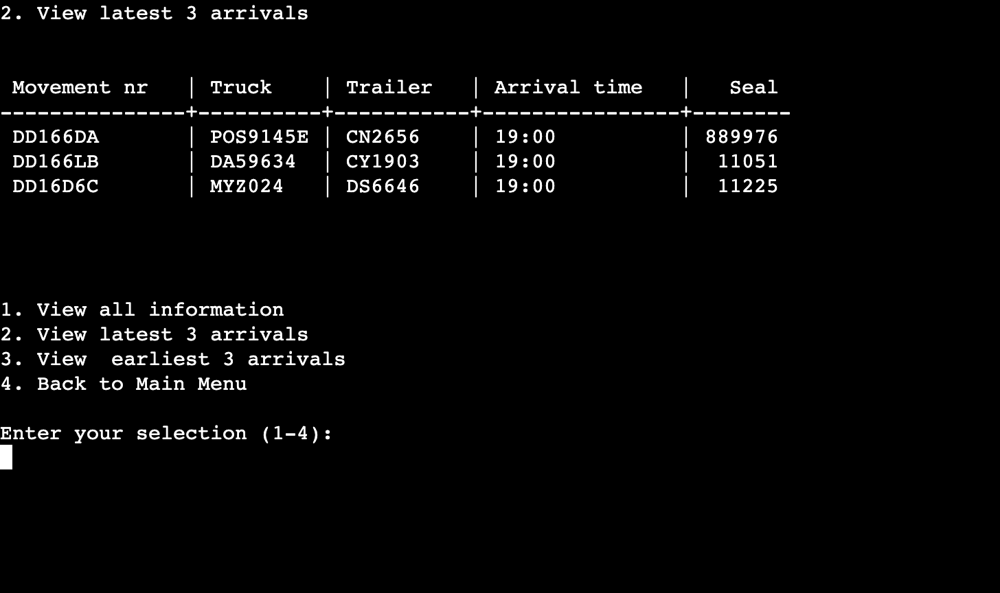
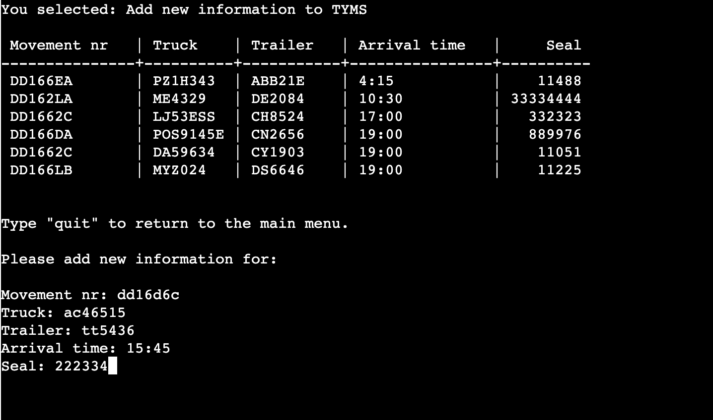

# Truck Yard Management System

## Table Of Contents

- [Truck Yard Management System](#truck-yard-management-system)
  - [Table Of Contents](#table-of-contents)
  - [Introduction](#introduction)
    - [Goals](#goals)
    - [Target Audience](#target-audience)
    - [Users Feedback](#users-feedback)
    - [Features Planned](#features-planned)
  - [Structure](#structure)
    - [Features](#features)
    - [Logical Flow](#logical-flow)

## Introduction

Transport yards play a crucial role in the logistics industry, serving as hubs for the temporary storage and transfer of goods. Effective management of these yards is essential to ensure smooth operations and timely delivery of cargo. TYMS offers a simplified solution to streamline the tracking and administration of truck movements within a transport yard.

### Goals

The primary goals of TYMS are as follows:

Efficient Information Management: TYMS enables users to store, organize, and access essential information related to truck movements, trailers, arrival times, and seals. The program provides functionalities to view, update, add, and delete data, ensuring accurate and up-to-date records.
Improved Operational Visibility: By providing different views of the transport yard information, such as all entries, latest arrivals, and earliest arrivals, TYMS allows users to gain valuable insights into the current status of the yard. This visibility helps optimize resource allocation, monitor truck movements, and make informed decisions.
Simplified Data Manipulation: TYMS simplifies the process of updating and modifying data within the system. It offers search and replace functionalities to quickly find specific entries and replace values as needed. Additionally, the program allows for the convenient addition of new data, ensuring comprehensive and complete records.
Integration with Google Sheets: TYMS leverages the power of Google Sheets as a backend storage solution. By utilizing the Google Sheets API, the program provides seamless synchronization and real-time collaboration capabilities, allowing multiple users to work on the same data simultaneously.

### Target Audience

TYMS is designed for individuals or teams involved in the management and operation of transport yards. The program caters to a wide range of users, including logistics managers, yard supervisors, dispatchers, and administrative staff. TYMS offers a simple and intuitive interface, making it accessible to users with varying levels of technical expertise.

Whether it is tracking truck movements, managing trailer information, monitoring arrival times, or maintaining seal records, TYMS provides a convenient and centralized solution for efficiently managing transport yard operations.

### Users Feedback

The TYMS program is a helpful tool for managing information related to movements in the transportation industry. It provides a user-friendly interface. It gives a professional feel to the program. Adding new information to TYMS is straightforward. The program prompts the user to enter data for each column, suggesting the headers as a guide. It validates the input format for specific columns, such as the arrival time and the seal number. This ensures data consistency and accuracy.

### Features Planned

- Search and Filter Functionality: Allow users to search for specific information based on criteria such as truck number, trailer number, or arrival time. This would make it easier to find specific entries in a large dataset.
- Sorting: Implement sorting options to organize the information in ascending or descending order based on different columns, such as arrival time or movement number. This would help users analyze the data more effectively.
- Notifications and Reminders: Integrate notification functionality to send reminders or notifications when a truck is expected to arrive or when an entry is modified.

## Structure

### Features

IMPLEMENTATION

---

- Main Menu Options:

  - When the program starts, a main menu option will appear with the following options:
    1. View TYMS Information
    2. Update Information in TYMS
    3. Add New Information to TYMS
    4. Delete Information from TYMS
    5. Exit TYMS
  - The user must input a correct number corresponding to each menu or they will be alerted of an incorrect choice and the menu will be presented again.
  - This feature will allow the user to easily access the sub-menus to each category to perform the operations needed.

**Main Menu**

**Invalid input**

---

- Sub-menu options for "View TYMS Information":
  - When a user selects "View TYMS Information" from the main menu, the following options will appear:
    1. View All Information - This option will print all information in the table.
    2. View Latest Three Arrivals - This option will print the latest 3 arrivals.
    3. View Earliest Three Arrivals - This option will print the earliest 3 arrivals.
    4. Back to Main Menu - This option will bring the user to the main menu.
  - The user must input a correct number corresponding to each menu or they will be alerted of an incorrect choice and the menu will be presented again.
  - This feature will allow the user to easily access the sub-menus to each category to perform the operations needed.

**View TYMS Information**

**View All Information**

**View Latest Three Arrivals**

**View Earliest Three Arrivals**

**Invalid input**

---

- Options for "Update Information in TYMS":
  - When a user selects Update Information in TYMS from the main menu, the following options will appear and the table will be printed:
    1. Find and Replace a Value - This option will ask the user to enter a value that is in the table and replace it with the new value. Each time value is found it will be printed as a whole row containing that value.
    2. Back to Main Menu - This option will bring the user back to the main menu when "quit is typed.
  - The user must input a correct value corresponding to the table or they will be alerted of an incorrect choice and the table will be presented again.
  - This feature will allow the user to easily perform the operations needed.

**Update Information in TYMS**

**Info found**

**Duplicate found**

**Replaced Info**

**Invalid input**

---

- Options for "Add New Information to TYMS":
  - When the user selects Add New Information to TYMS, the table will be printed and will be prompted to enter new information in the following order.
      1. Movement nr - This option lets the user enter up to 10 characters in the string.
      2. Truck - This option lets the user enter up to 10 characters in the string.
      3. Trailer - This option lets the user enter up to 10 characters in the string.
      4. Arrival time - This option asks the user to enter time in HH:MM format.
      5. Seal - This option lets the user enter up to 10 digits.
  - The user must input a correct value corresponding to the table or they will be alerted of an incorrect choice.
  - This feature will allow the user to easily perform the operations needed.
  - Users can type "quit" while entering new information to back to the main menu.

**Add New Information to TYMS**

**Add New Info**

- Option for "Delete Information from TYMS":
  - When the user selects Delete Information from TYMS, the table will be printed with the row numbers and the user will be prompted to enter the corresponding row number to delete it.
  - When the user enters the row number they will be asked to confirm their choice by pressing the "Enter" button on a keyboard or typing "cancel" to cancel the operation and back to the main menu.
  - If a user press the "Enter" the program deletes the selected row and asks the user to continue or leave the operation by typing "y" or "n" respectively.
  - Back to Main Menu - When the user type "quit" instead of row number, the program goes back to the main menu.

### Logical Flow

**Main Menu**

**View Information**

**Update Tyms**

**Add Information**

**Delete Information**
